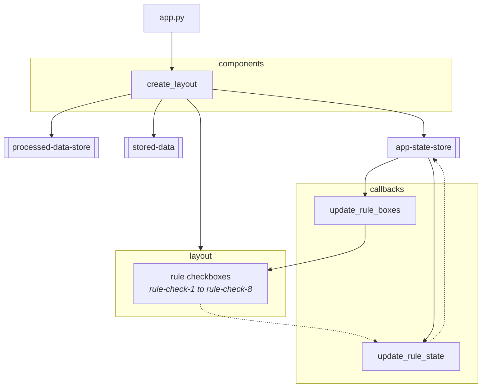

# Process Behaviour Chart App (with Flask and Dash)

## Setup

1. Create a virtual environment:
   ```
   python -m venv venv
   ```

2. Activate the virtual environment:
   - Windows: `venv\Scripts\activate`
   - Linux/Mac: `source venv/bin/activate`

3. Install dependencies:
   ```
   pip install -r requirements.txt
   ```

4. Run the application:
   ```
   python app/app.py
   ```

5. Open your browser and navigate to `http://127.0.0.1:5000/`

## Architecture

`app.py` initializes a Flask server and wraps it with Dash to build the UI.
It sets up the main layout, dynamically injects rule selection boxes, and registers all callbacks.




### Data Stores (dcc.Store)

#### `stored-data`

* Holds the **raw uploaded or sample-loaded DataFrame**.
* Written by: `update_output()` (after upload/button click)
* Read by: downstream callbacks (e.g. download, reprocessing)

#### `processed-data-store`

* Holds the **post-rule-evaluation DataFrame** (i.e., with Nelson rule results).
* Supports downstream use like downloading, plotting with rule overlays.

#### `app-state-store`

* Holds **UI state** and **global user settings**, like:

  * Selected rule checkboxes (`rule-check-X`)
  * Chart settings (`sl-range-slider`, `dropdown-period-type`, etc.)
* Is read by:

  * Data reprocessing logic (e.g., rerun rules if chart settings changed)
  * Checkbox appearance logic (change rule card highlight if enabled/disabled)
* Written by:

  * `update_app_state_settings()`
  * `update_rule_state()`

### Callbacks

#### rule_checkbox.py

##### `update_rule_state()`

On any rule checkbox change, updates `app-state-store['rules']` with checked states.

##### `update_rule_boxes()`

Renders rule box styling (`selected`/default) based on `app-state-store['rules']`.
